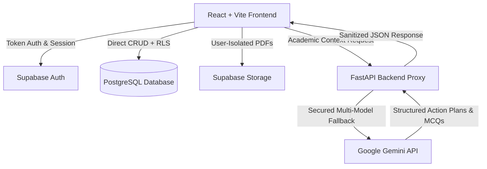
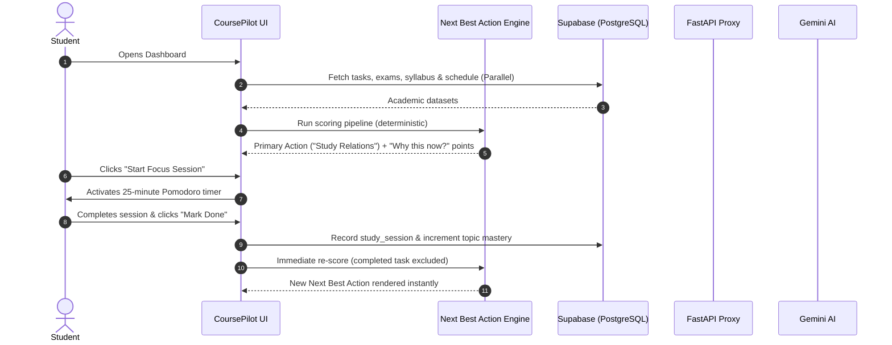

# CoursePilot Architecture

This document provides a technical breakdown of CoursePilot's system architecture, component responsibilities, data flow, and algorithmic design.

---

## 1. System Overview

CoursePilot is a full-stack, AI-augmented academic operating system built to eliminate decision fatigue for university students. Unlike traditional static to-do applications, CoursePilot continuously evaluates dynamic academic parameters—including timetable free periods, upcoming exam dates, topic mastery scores, and active assignment deadlines—to produce a single, deterministic recommendation called the **Next Best Action**.



---

## 2. Component Responsibilities

### 2.1 Frontend (`React 19` + `Vite` + `Tailwind CSS`)
- **Single Page Application (SPA)**: Client-side routing with clean state preservation.
- **Decision Engine Execution**: Evaluates the 5-stage deterministic Next Best Action pipeline inside `useMemo` hooks to provide instantaneous feedback without network roundtrips.
- **State Management**: React state hooks with optimistic UI updates for instant interaction response.
- **Document Parsing**: In-browser PDF text extraction via `pdfjs-dist` worker threads before cloud storage transmission.
- **Visual Design System**: Tailored typography (`Inter`, `Plus Jakarta Sans`, `JetBrains Mono`) with accessible contrast, custom SVG iconography, and responsive layouts across all screen breakpoints.

### 2.2 Database & Storage Layer (`Supabase` / `PostgreSQL`)
- **Authentication**: JWT-based session persistence with secure refresh mechanisms.
- **Relational Schema**:
  - `student_profiles`: Academic identity (semester, section).
  - `academic_subjects`: Core theory courses and lab modules.
  - `class_schedule`: Day-by-day timetable mapping lectures to rooms and faculty.
  - `syllabus_topics`: Formal curriculum units and concept descriptions.
  - `tasks`: Student assignment deliverables with due dates, importance ratings, and completion flags.
  - `exams`: Target assessment milestones with dates and academic weighting.
  - `topics`: User-scoped topic progress records and adaptive mastery scores ($0–100\%$).
  - `study_sessions`: Logged deep-work sessions tracking focus duration and linked task IDs.
- **Row Level Security (RLS)**: Enforces database-level isolation so students can only read and mutate their own academic records (`auth.uid() = user_id`).
- **Private Storage**: User-scoped buckets (`study-material/${user.id}/*`) for course documents.

### 2.3 Backend API Layer (`FastAPI` + `Python 3.12`)
- **Secure AI Proxy**: Isolates the `GEMINI_API_KEY` on the server to prevent exposure to client browsers.
- **Input Sanitization & Validation**: Pydantic models enforce character limits, bounded ranges, and structural integrity.
- **Multi-Model Reliability Pipeline**: Implements automatic fallback across available Gemini Flash model tiers (`gemini-flash-latest`, `gemini-3.5-flash`, `gemini-flash-lite-latest`, `gemini-3.7-flash`, `gemini-2.5-flash`) to ensure high availability during third-party quota spikes.
- **Security Middleware**: Injects `nosniff`, `DENY` framing, and strict cross-origin policies.

---

## 3. The Next Best Action Engine

The Next Best Action engine is a deterministic algorithm designed to solve the prioritization problem without relying on unpredictable AI hallucinations for raw scoring.

```text
[ Academic Context ]
  • Timetable (classes & free slots)
  • Pending Tasks (deadlines & effort)
  • Upcoming Exams (days remaining & importance)
  • Topic Mastery (syllabus & quiz performance)
          │
          ▼
[ Candidate Generation ]
  Generates candidate actions: ATTEND_CLASS, SUBMIT_ASSIGNMENT,
  PREPARE_FOR_EXAM, STUDY_TOPIC, REVIEW_SCHEDULE
          │
          ▼
[ Multi-Factor Scoring (0 - 100) ]
  Score = 0.30(Urgency) + 0.25(Impact) + 0.20(Risk) + 0.15(TimeRelevance) + 0.10(Importance) - EffortPenalty
          │
          ▼
[ Conflict Resolution Rules ]
  • If class starts in <= 15 mins -> ATTEND_CLASS takes absolute priority.
  • Completed/deleted tasks are strictly excluded from candidates.
  • Exam <= 3 days with topic mastery < 60% receives CRITICAL priority boost.
          │
          ▼
[ Top Recommendation + Explainability ]
  Outputs single primary action with human-readable "Why this now?" rationale points.
```

---

## 4. End-to-End Feedback Loop



---

## 5. Deployment Topology

| Component | Host / Platform | Configuration |
| :--- | :--- | :--- |
| **Frontend** | Vercel | Automatic CI/CD from `main` branch, SPA rewrite rules, production HTTP security headers. |
| **Backend** | Render | Managed web service running `uvicorn main:app --host 0.0.0.0 --port 10000`, environment variable isolation. |
| **Database & Storage** | Supabase | Managed PostgreSQL instance with RLS, Auth, and Storage engines. |
| **LLM Provider** | Google Cloud | Gemini developer API endpoints. |
