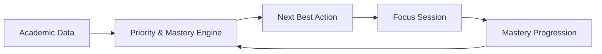

# CoursePilot — Pitch Deck & Presentation Guide

**Presenter:** Shivam Kumar  
**Specialization:** B.Tech CSE / AI-ML  
**Duration:** ~2.5 Minutes (6 Slides)

---

## Slide 1: Title & Vision

```text
┌────────────────────────────────────────────────────────────────────────┐
│                                                                        │
│                              COURSEPiLOT                               │
│                 Your AI-Powered Academic Co-Pilot                      │
│                                                                        │
│          "Eliminating study decision fatigue for university students"  │
│                                                                        │
│   Presenter: Shivam Kumar                                              │
│   Track: B.Tech Computer Science & Engineering (AI-ML)                 │
│   Live Demo: ai-campus-copilot-one.vercel.app                          │
│                                                                        │
└────────────────────────────────────────────────────────────────────────┘
```

### Key Visuals & Bullet Points
* **Product:** CoursePilot
* **Category:** Academic Operating System & Next Best Action Engine
* **Mission:** Turning chaotic semester deadlines into a single, high-yield study priority.

> 🎙️ **Speaker Notes (25 seconds):**  
> *"Good morning, everyone. I'm Shivam Kumar, and today I'm presenting CoursePilot—an AI-powered academic co-pilot. Every semester, university students struggle not with a lack of study material, but with decision fatigue: knowing what to study next. CoursePilot is built to solve that exact problem."*

---

## Slide 2: The Problem — Academic Fragmentation & Decision Fatigue

```text
  [ Assignments ]    [ Exams ]       [ Timetable ]      [ PDFs / Notes ]
        │                │                 │                  │
        └────────────────┴────────┬────────┴──────────────────┘
                                  ▼
                     [ Traditional To-Do Apps ]
                     ❌ Passive checklists
                     ❌ Zero academic context
                     ❌ Ignores exam proximity & weak topics
                                  ▼
                   💥 "What should I study right now?"
```

### Key Bullet Points
* **Scattered Information:** Students juggle assignments, exam schedules, lecture timetables, and lecture PDFs across separate tools.
* **Passive Task Managers:** Standard to-do apps treat a minor homework sheet due in two weeks the same as a critical exam in three days.
* **No Mastery Awareness:** Existing apps don't track which syllabus units you are actually struggling with.
* **Result:** Constant uncertainty, last-minute cramming, and misallocated study hours.

> 🎙️ **Speaker Notes (25 seconds):**  
> *"Today's students manage their academic lives across fragmented spreadsheets, WhatsApp groups, and generic to-do apps. But traditional task managers are passive—they don't understand that an exam in three days makes your weakest syllabus topic infinitely more urgent than a routine homework sheet. Students end up wasting precious energy just deciding where to begin."*

---

## Slide 3: The Solution — Unified Academic Intelligence

```text
┌────────────────────────────────────────────────────────────────────────┐
│                          THE SOLUTION                                  │
│                                                                        │
│   1. Unified Context       ──► Merges timetable, tasks, exams & topics │
│   2. Next Best Action      ──► Recommends ONE highest-impact task      │
│   3. Explainability        ──► "Why this now?" transparent rationale   │
│   4. Adaptive Mastery      ──► Continuously updates with your progress │
│                                                                        │
│                 ★ CORE DIFFERENTIATOR: NEXT BEST ACTION ★               │
└────────────────────────────────────────────────────────────────────────┘
```

### Key Bullet Points
* **Unified Workspace:** Timetable, assignment deliverables, syllabus units, and exam dates synchronized in one place.
* **Deterministic Priority Engine:** Replaces guesswork with a mathematically ranked **Next Best Action**.
* **Explainable Recommendations:** Shows transparent *"Why this now?"* reasoning behind every study suggestion.
* **Adaptive Feedback:** Your topic mastery progression automatically reshapes future study priorities.

> 🎙️ **Speaker Notes (25 seconds):**  
> *"CoursePilot changes this paradigm. Instead of giving you a daunting checklist of 20 items, it evaluates your complete academic landscape to surface a single **Next Best Action**. It doesn't just tell you what to study—it explains *why* that topic matters right now, and adapts as you complete work."*

---

## Slide 4: How It Works — The Closed-Loop Feedback Engine



### Key Flow Components
1. **Academic Ingestion:** Enrolled subjects, timetable lectures, active assignment deadlines, and exam milestones.
2. **Deterministic Priority Scoring:** $\text{Score} = 30\%\text{Urgency} + 25\%\text{Impact} + 20\%\text{Risk} + 15\%\text{Time} + 10\%\text{Importance} - \text{Effort}$.
3. **External Signals:** Integrates real **Google Calendar** free windows and **Smart Notifications** with quiet-hours suppression.
4. **Action Execution:** Launch distraction-free 25-minute Pomodoro **Focus Sessions** or adaptive AI quizzes.
5. **Real-Time Recalculation:** Completing a task updates your mastery score ($0–100\%$) and recalculates your next priority instantly.

> 🎙️ **Speaker Notes (30 seconds):**  
> *"Here is how CoursePilot works. Our engine continuously processes your timetable, deadlines, and syllabus scores through a multi-factor priority formula. It syncs with Google Calendar to match high-priority topics to your actual free study windows. Once you finish a 25-minute focus session, your mastery updates and the system automatically recalculates the next priority."*

---

## Slide 5: Technology Stack — Full-Stack Production Architecture

```text
┌───────────────────────────────┬───────────────────────────────┐
│ LAYER                         │ TECHNOLOGY                    │
├───────────────────────────────┼───────────────────────────────┤
│ Frontend SPA & PWA            │ React 19 • Vite 8 • Tailwind  │
│ Backend API Proxy             │ FastAPI • Python 3.12 • Uvicorn│
│ Database & Storage            │ Supabase • PostgreSQL • RLS   │
│ Generative AI Engine          │ Google Gemini API             │
│ External Calendar             │ Google Calendar OAuth 2.0 API │
│ Production Hosting            │ Vercel (Edge) • Render (Cloud)│
└───────────────────────────────┴───────────────────────────────┘
```

### Architectural Highlights
* **Zero Client Secret Exposure:** LLM tokens and OAuth refresh keys reside strictly on the FastAPI server.
* **Row Level Security (RLS):** Database-enforced student data isolation on every PostgreSQL transaction.
* **Progressive Web App (PWA):** Installable on Android & iOS with App Shell caching and offline resilience.

> 🎙️ **Speaker Notes (25 seconds):**  
> *"Under the hood, CoursePilot is built as a production-grade SaaS application. The frontend uses React 19 and Vite configured as an installable PWA. The backend runs FastAPI in Python, acting as a secure proxy to Google Gemini and Google Calendar. PostgreSQL on Supabase enforces Row Level Security to guarantee strict multi-tenant privacy."*

---

## Slide 6: Key Impact & Closing

```text
┌────────────────────────────────────────────────────────────────────────┐
│                         WHY COURSEPiLOT?                               │
│                                                                        │
│   ✓ Deterministic Prioritization  — No AI hallucinations on deadlines  │
│   ✓ Transparent & Explainable     — "Why this now?" clarity            │
│   ✓ Closed-Loop Adaptive Learning — Progress reshapes recommendations  │
│   ✓ Calendar-Aware Scheduling     — Study blocks fit your free hours   │
│                                                                        │
│                             COURSEPiLOT                                │
│          "Know what to study. Know why. Know what's next."             │
│                                                                        │
│                            THANK YOU!                                  │
│                    Q&A • Live Demo Available                           │
└────────────────────────────────────────────────────────────────────────┘
```

### Impact Takeaways
* **Time Saved:** Eliminates 30+ minutes of daily academic planning paralysis.
* **Exam Preparedness:** Focuses study time on highest-risk syllabus topics before major milestones.
* **Scalable Architecture:** Modular full-stack codebase ready for institutional LMS integrations.

> 🎙️ **Speaker Notes (20 seconds):**  
> *"In summary, CoursePilot replaces chaotic academic clutter with actionable clarity. It ensures students always know what to study, why it matters, and what to tackle next. Thank you, and I’d be glad to walk you through a live demonstration."*
